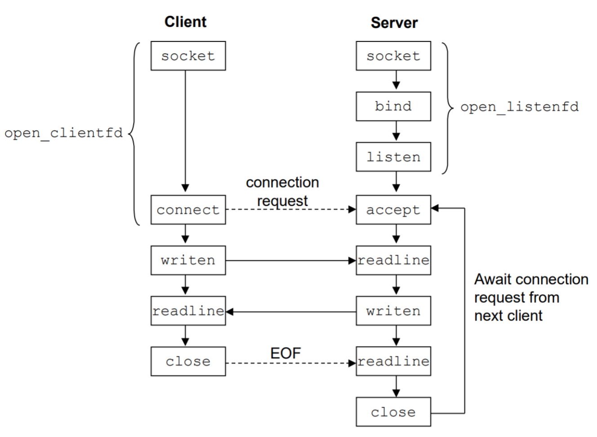

# Chapter 11: Network Programming

## The Client-Server Programming Model

## Networks

## The Global IP Internet
### IP Addresses
An IP address is an unsigned 32-bit integer. Rust defines the *IP address* struct shown below for network programs to store IP addresses. Storing IP addresses in a structure like this allows for us to more easily break the address into parts, manipulate it, and perform conversions on it.

```rust, ignore
pub struct Ipv4Addr {
    inner: c::in_addr,
}

impl Ipv4Addr {
    pub const fn new(a: u8, b: u8, c: u8, d: u8) -> Ipv4Addr {
        // `s_addr` is stored as BE on all machine and the array is in BE order.
        // So the native endian conversion method is used so that it's never swapped.
        Ipv4Addr { inner: c::in_addr { s_addr: u32::from_ne_bytes([a, b, c, d]) } }
    }

    pub const fn octets(&self) -> [u8; 4] {
        // This returns the order we want because s_addr is stored in big-endian.
        self.inner.s_addr.to_ne_bytes()
    }
}
```
To ensure that IP addresses are usable consistently across both big-endian and little-endian systems, TCP/IP standardized that the encoding for IP addresses (and indeed, all network traffic) should be *big-endian*. This is also called *network byte order*. To enforce this invariant in our Rust code, the implementation of the IP address struct uses a rather obscure function: `u32::from_ne_bytes`. This function creates a 32-bit integer from a series of one-byte integers (`u8`). To do so, it assumes that the series of bytes that are passed to it are already in the proper increasing order based on the system's endianness: on a bit-endian system it assumes that the first byte passed is the most significant byte, and on a little-endian system it assumes that the first byte passed is the least significant byte. This ensures that when the final address is placed into memory, it will always be stored in big-endian representation if the bytes are passed in the order that humans typically read an IP address. If we want to get the bytes back in the correct network byte order, we can use the `#octets` method on the IP address struct.

### Internet Domain Names

## The Sockets Interface
The sockets interface is a set of functions that are used in conjunction with the Unix I/O functions to build network applications. It has been implemented on most modern systems, including all Unix variants as well as Windows and Macintosh systems. Below is an overview of the sockets interface in the context of a typical client-server transaction. Rust provides abstractions over top of the low-level sockets interface to make it even easier to set up network programming. Instead of going through each of the sockets interface functions individually, we will go through the main functions used in Rust to create and use sockets and explain which functions of the sockets interface are used under-the-hood.


### Socket Address Structures
From the perspective of the Linux kernel, a socket is an endpoint for communication. From the perspective of a Linux program, a socket is an open file with a corresponding descriptor.

Internet socket addresses are stored in Rust in the `SocketAddrV4` struct. Internally, this struct stores the C representation of a socket address, called a `sockaddr_in`. The details of this C struct can be found below.

```rust, ignore
/* IP socket address structure */
struct sockaddr_in {
    uint16_t        sin_family;     /* Protocol family (aslways AF_INET) */
    uint16_t        sin_port;       /* Port number in network byte order */
    struct in_addr  sin_addr;       /* IP address in network byte order */
    unsigned char   sin_zero[8];    /* Pad to sizeof(struct sockaddr) */
};

/* Generic socket address structure (for connect, bind, and accept) */
struct sockaddr {
    uint16_t    sa_family;      /* Protocol family */
    char        sa_data[14];    /* Address data */
};
```
A socket address includes at least a **family** (always `AF_INET` for IP addresses), an **address** (a 32-bit IP address), and a **port**. Most of the time, you won't create the `SocketAddrV4` directly. Rust provides a trait called `ToSocketAddrs` that allow other, more common values (such as `&str`) to be converted to `SocketAddrV4`. For the content in this book, we will use `&str`s to represent our addresses and ports in a common and readable format used in networking.

### The `TcpListener` Struct
One of the most common ways to implement network programming in Rust is via paired objects known as `TcpStreams` and `TcpListeners`. The latter of these two acts as a server: it *listens* for incoming connections and allows them to be accepted in turn. Naturally, this kind of socket is called a listening socket, and the `TcpListener` uses some internal calls to the operating system that involve the `listen` function from the socket interface specification to indicate that this socket should stay passively open in the background, prepared to accept an incoming request.

### Starting the Server
Before we can address the specifics of making and accepting network connections in Rust, we'll provide some sample code that we can reference in the next few sections.

```rust, ignore
use std::net::TcpListener;
use std::io::{Read, Write, BufReader, BufRead};

pub fn make_socket() {
    let server = TcpListener::bind("127.0.0.1:8080").unwrap_or_else(|_| {
        panic!("Couldn't bind to port");
    });

    for connection in server.incoming() {
        println!("New connection!");

        let mut connection = match connection {
            Err(_) => {
                println!("Couldn't connect to client.");
                continue;
            },
            _ => connection.unwrap()
        };

        let mut string = String::new();
        let mut reader = BufReader::new(&connection);
        if let Err(_) = reader.read_line(&mut string) {
            println!("Unable to read from connection.");
            continue;
        }

        println!("From client: {}", string);

        let response = "Hello!";
        if let Err(_) = connection.write_all(response.as_bytes()) {
            println!("Unable to write to connection.");
            continue;
        }

        println!("Connection closed.");
    }
}
```
The code above will create a new listening socket, allow connections to it, read one line of data (ending in `'\n'`) from the client, and then respond with the word `"Hello!"`.

Creating a new `TcpListener` and opening it to allow inbound connections can be done in one step in Rust, seen on line 5 of the example code above. There is a lot of heavy-lifting going on in this one line, so we'll go into more depth on what's actually happening there.

On that line, we call `TcpListener::bind` and pass it something that Rust knows how to interpret as a socket address. In this case, the common internet format of separating an IPv4 address and a TCP port with a colon is used. The address chosen, `127.0.0.1`, is a good choice since it works on any machine and only allows connections in from the same machine, which makes it very safe to use.

Internally, calling bind with this argument does the following:
1. Splits the argument that it was given (`127.0.0.1:8080`) into a port and an address. If the IP address given is a *domain name* instead of an IP address (such as `www.example.com`),
2. Creates a new socket on the system via the `socket` method. It also specifies the type of address we are using (internally, `AF_INET` or 32-bit IPv4 addresses) and the type of connection to be  made (`SOCK_STREAM`, which corresponds to the TCP protocol).
3. Asks the system to `bind` this new socket to the address and port that we decoded in step 1.
4. Tells the system that we are now accepting new connections by calling the `listen` method.

There is a lot of abstraction in this one function call! Each of these steps would have had to be taken separately in C. Now, we get to the interesting part: accepting new connections.
<br>

<span style="border: 1px solid #008bb2;
             border-radius: 5px;
             background-color: #60dcff;
             display: block;
             padding: 15px;
             color: #000833;">
**Aside** &nbsp; 127.0.0.1 <br>
The Internet has many organizations that govern it, and the one that deals specifically with the way that IP addresses are assigned and allocated is called **IANA**, or the **Internet Assigned Numbers Authority**. IANA has divided up the IPv4 address space into many different blocks, each of which has specific uses. Addresses of the form `10.x.x.x`, `172.y.x.x` (where `y` is between 16 and 31, inclusive), or `192.168.x.x`, for example, aren't routable on the public internet — they are for private use only. One of the better-known special blocks of IP addresses is the set of all addresses of the from `127.x.x.x`, specifically `127.0.0.1` with the alias "`localhost`". On nearly every networked machine, this address is configured to route back to the machine itself. This is of great use to developers who are running code that runs over a network on their own computers, since accessing this code doesn't require that they know their IP address on the network (nor that they be on a network at all). They can reach their own machine by simply connecting to `127.0.0.1` or `localhost`.
</span>

### Accepting Connections
Now that we have converted our address and port into a form that the system can understand, created a new socket, bound it to the port and address that we wanted, and marked it as acceptign new connections, we have to actually process requests that come in. In the sample code, this occurs in the for loop beginning on line 9:
```rust, ignore
    for connection in server.incoming() {
        println!("New connection!");

        let mut connection = match connection {
            Err(_) => {
                println!("Couldn't connect to client.");
                continue;
            },
            _ => connection.unwrap()
        };

        let mut string = String::new();
        let mut reader = BufReader::new(&connection);
        if let Err(_) = reader.read_line(&mut string) {
            println!("Unable to read from connection.");
            continue;
        }

        println!("From client: {}", string);

        let response = "Hello!";
        if let Err(_) = connection.write_all(response.as_bytes()) {
            println!("Unable to write to connection.");
            continue;
        }

        println!("Connection closed.");
    }
```

Iterating over `server.incoming()` is fundamentally the same as repeatedly calling `server.accept()`, which internally calls the accept function on the socket interface. A nearly equivalent way of writing this loop is as follows:

```rust, ignore
loop {
    let connection = server.accept();

    // loop body
}
```
In either case, this function call blocks the program from continuing to work until a new connection is available. At this point, there are two different sockets that our program is dealing with: the socket attached to the newly-connected client, and the listener, which remains available for new connections.

Once we have our new connection, the iterator will yield a `TcpStream`.

<span style="border: 1px solid #008bb2;
             border-radius: 5px;
             background-color: #60dcff;
             display: block;
             padding: 15px;
             color: #000833;">
**Aside** &nbsp; `incoming()` versus `accept()`
When we accept an incoming connection by using `TcpListener#accept`, we are actually returned a tuple of two values: the new `TcpStream` itself and the `SocketAddress` identifying the client. When we iterate over incoming connections using `TcpListener#incoming`, we only get the client `TcpStream`. Often, when we are handling an incoming connection, where the connection came from is not important, so it's not necessary to have the `SocketAddr` of the client. In other situations, especially where security is a concern, this is a very important piece of information, and `TcpListener#accept` should be used over `TcpListener#incoming`.
</span>

### Connecting to a Listener
Now that we know how to set up a listener of our own, it's time to explore the other side of the process: creating a client that could connect to our listener. Thankfully, this process is even simpler than creating the listener. Some example code that we will reference is below:

```rust, ignore
use std::net::TcpStream;
use std::io::{Write, Read};

pub fn make_connection() {
    let mut connection = match TcpStream::connect("127.0.0.1:8080") {
        Err(_) => {
            println!("Couldn't connect to server.");
            return;
        },
        Ok(connection) => connection
    };

    let to_send = "Here's a line of data!\n";
    if let Err(_) = connection.write_all(to_send.as_bytes()) {
        println!("Unable to write to connection.");
        return;
    }

    let mut received: Vec<u8> = vec![];
    if let Err(_) = connection.read_to_end(&mut received) {
        println!("Unable to read from connection.");
        return;
    }

    let mut received_string = match String::from_utf8(received) {
        Err(_) => {
            println!("Server sent non-UTF8 response.");
            return;
        },
        Ok(str) => str
    };

    println!("From server: {}", received_string);
}
```

To connect to a listener that already exists, we use the `TcpStream::connect` method found on line 5 of the code above. As one might expect, this calls the corresponding socket interface `connect` method to solidify that this socket is a client socket, and to cause the operating system to finalize making a connection to the requested destination.

## Putting It Together: The <span style="font-variant: small-caps;">Tiny</span> Web Server